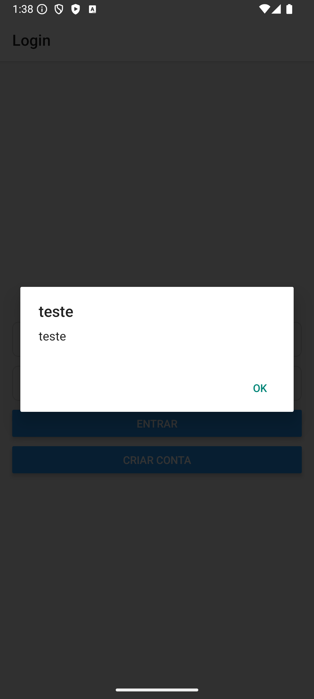

# Vinhos Store · Exemplo React Native + Firebase

Um app **exemplo de e-commerce** mobile feito com **React Native** e **Firebase**, usando a **Fake Store API** como fonte de produtos e **Firestore** para persistir favoritos por usuário. Também traz **tema claro/escuro**, **carrinho local** e **push notifications (FCM - Firebase Cloud Messaging)**.

## Funcionalidades

- **Autenticação (email/senha)** — Firebase Auth (API modular).
- **Lista de produtos** — Fake Store API (HTTP).
- **Favoritos por usuário** — coleção no Firestore.
- **Carrinho** — estado local + modal de detalhes do produto.
- **Tema** — Design tokens + ThemeProvider (System / Light / Dark), navegação tematizada.
- **Push Notifications (FCM)** — Android pronto; iOS requer APNs (documentado).

---

## Stack

- **Base:** React Native + TypeScript
- **Navegação:** React Navigation (Native Stack / Bottom Tabs)
- **Firebase (modular):** Auth, Firestore, Messaging
- **HTTP:** fetch/axios (a seu critério)
- **Estado/Contexto:** Providers (Auth/Theme) e Context de Carrinho
- **Qualidade:** ESLint, Prettier, Jest
- **CI:** GitHub Actions

---

## Organização do projeto

```
src/
  api/                # clientes HTTP (Fake Store API)
  assets/             # imagens, icones e outros assets úteis
  components/         # UI compartilhada (Icon, Button, etc.)
  constants/          # valores fixo imutáveis
  firebase/            # inicializador e configuração do firebase
  hooks/              # custom hooks. ex.: useFavorites()
  navigation/         # AppNavigator com Bottom Tab e Stack navigation
  providers/          # AuthProvider, ThemeProvider, CartProvider
  screens/            # Login, Register, Products, Favorites, Cart, Settings
  theme/              # tokens, light/dark
  utils/              # helpers genéricos
```

**Firestore (estrutura):**

```
users/{uid}/favorites/{productId}
  {
    id: string,
    title: string,
    image: string,
    price: number,
    // ...snapshot imutável do produto/favorito
  }
```

---

## Screens & Push

- Login / Cadastro
- Produtos (lista, favoritar, adicionar ao carrinho)
- Modal de detalhes do produto
- Favoritos (lidos do Firestore)
- Carrinho
- Configurações (tema: system / light / dark)

**Push (Android) – exemplo de teste via FCM:**



## Como rodar

### 1) Instalar dependências

```bash
yarn
# ou
npm i
```

### 2) Firebase (obrigatório)

1. Crie um projeto no **Firebase Console** e adicione apps **iOS** e **Android** com **Bundle ID/ApplicationId** iguais aos do projeto.
2. **Authentication → Sign-in method:** habilite **Email/Password**.
3. **Cloud Firestore → Rules:** cole e publique as regras abaixo.
4. Baixe os arquivos de configuração e coloque nos caminhos:
   - iOS: `ios/GoogleService-Info.plist`
   - Android: `android/app/google-services.json`

**Regras do Firestore**

```txt
rules_version = '2';
service cloud.firestore {
  match /databases/{db}/documents {
    match /users/{uid}/favorites/{docId} {
      allow read, write: if request.auth != null && request.auth.uid == uid;
    }
  }
}
```

### 3) iOS

```bash
cd ios && pod install && cd ..
yarn ios
```

> Dica: se o Xcode acusar cache estranho, apague **DerivedData**, feche/reabra o Xcode e rode de novo.

### 4) Android

```bash
yarn android
```

### 5) Dev server (se precisar resetar cache)

```bash
yarn start --reset-cache
```

---

## Push Notifications (FCM)

Este projeto usa `@react-native-firebase/messaging`.

### Android

- A permissão **POST_NOTIFICATIONS** é solicitada automaticamente no Android 13+.
- Em **foreground**, as mensagens são tratadas via `messaging().onMessage(...)`.
- Para testar:
  - Rode o app em **dispositivo/emulador com Play Services**.
  - Capture o token no log (`[FCM] token: ...`).
  - Envie **Test Message** pelo Firebase Console (Cloud Messaging).

### iOS

> Requer conta **Apple Developer** e **APNs (Apple Push Notification)** configurado. Sem APNs, iOS **não recebe push** (simulador também não).

Passos resumidos:

1. Apple Developer → **Keys** → “+” → marque **APNs** → gere a **Auth Key (.p8)** e anote **Key ID** + **Team ID**.
2. Firebase Console → **Project settings → Cloud Messaging → Apple app configuration** → envie a `.p8` + Key ID + Team ID.
3. No Xcode (Target): ative **Push Notifications** e **Background Modes → Remote notifications**.
4. Rode em **dispositivo físico**; o app chamará `registerDeviceForRemoteMessages()` e `requestPermission()`.

---

## Scripts úteis

```json
{
  "scripts": {
    "start": "react-native start",
    "android": "react-native run-android",
    "ios": "react-native run-ios",
    "lint": "eslint . --ext .ts,.tsx",
    "typecheck": "tsc --noEmit",
    "test": "jest --passWithNoTests",
    "ci": "yarn lint && yarn typecheck && yarn test"
  }
}
```

### Dependências de desenvolvimento (sugeridas)

```bash
yarn add -D eslint @react-native-community/eslint-config   @typescript-eslint/parser @typescript-eslint/eslint-plugin   eslint-plugin-import eslint-plugin-react-hooks   prettier jest @types/jest react-test-renderer
```

---

## Decisões de arquitetura (resumo)

- **Firebase modular**: `getAuth`, `onAuthStateChanged`, `getFirestore`, etc.
- **Favoritos desacoplados da API externa**: guardamos um **snapshot** do produto por usuário no Firestore; a tela de favoritos não depende da Fake Store API estar online.
- **Tema**: tokens (`spacing`, `radius`, `font`, `colors`) + persistência de preferência (system/light/dark).
- **Navegação tematizada**: cores/título/ícones variam conforme o tema.
- **Foco pedagógico**: código organizado por **providers**, **components**, **hooks** e **screens**, facilitando evolução.

---

## Troubleshooting rápido

- **iOS CocoaPods**: rode `cd ios && pod install`. Se falhar, tente `pod repo update` e `pod deintegrate && pod install`.
- **Metro bundler** falhar: `yarn start --reset-cache`.
- **Android Build**:
  - Limpeza: `cd android && ./gradlew clean && cd ..`
  - Verifique o `google-services.json` e a versão do Play Services do emulador.
- **FCM token não aparece**: confira se os arquivos do Firebase estão nos caminhos corretos e se o app abriu pelo menos uma vez com internet.

### Caminhos sugeridos:

- **Android:**
  `androd/app/google-services.json`
- **iOS:**
  `ios/GoogleService-Info.plist`
  > Conferir se dentro do XCode → ProjectName → Target → Build Phases → Copy Bundle Resources - Referência o arquivo GoogleService-Info.plist

---

## Créditos & Licença

- Produtos: **[Fake Store API](https://fakestoreapi.com/)**
- Firebase: **Auth / Firestore / Messaging**
- Licença: MIT
